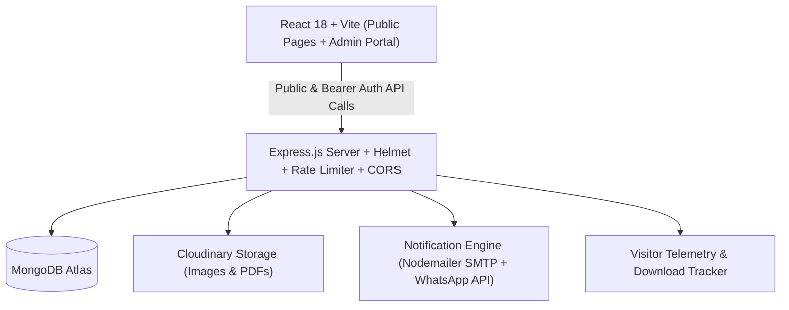

# Full-Stack Personal Portfolio & Resume Management System
**Engineered for Hariharan Ravikumar**

A production-grade, enterprise-architected Personal Portfolio and Multi-Resume Management System built with the **MERN Stack** (MongoDB Atlas, Express.js, React.js, Node.js). Features role-based JWT authentication, modern glassmorphism UI with Dark/Light mode, multi-resume management with download tracking, live visitor analytics, and automated dual-channel notification dispatch (SMTP Email + WhatsApp Alerts).

---

## Architecture Overview



---

## Key Features

### 1. Public Portfolio
- **Home Page**: Profile photograph with halo glow, dynamic typing animation across multiple titles, headline introduction, Quick Action buttons ("Hire Me", "Download Resume", "Contact Me"), GitHub metrics, and live visitor counter.
- **About Page**: Personal biography, career objectives, academic timeline, internship experience, key achievements, core strengths, and bilingual language proficiencies with progress indicators.
- **Skills Page**: Categorized into *Frontend*, *Backend*, *Database*, and *Tools*, featuring animated progress bars and percentage meters.
- **Projects Page**: Project catalog with search and category filters (*Full Stack*, *MERN Stack*, *Frontend*, *Backend*), screenshot carousel slider, live demo links, source code repositories, and project documentation PDFs.
- **Experience Page**: Internship and career timeline detailing corporate contributions, technical responsibilities, and verified internship completion certificates.
- **Certificates Page**: Verified credential cards, issuer details, issue dates, and PDF/image credential modal viewer.
- **Resume Page (Multi-Resume Central)**: 5 specialized resume variants:
  1. *Frontend Developer Resume*
  2. *MERN Stack Developer Resume*
  3. *Full Stack Developer Resume*
  4. *Technical Support Engineer Resume*
  5. *Software Engineer Resume*
  - Includes in-page PDF viewer modal, live download tracking counter, file size metadata, and last-updated indicators.
- **Blog Page**: Technical articles with category filtering, reading time estimates, view tracking, and an interactive visitor comments thread.
- **Contact Page**: Validated inquiry form triggering instant persistence to MongoDB Atlas, administrative email alert via Nodemailer, WhatsApp notification via Twilio/webhook, and auto-reply acknowledgment email to the visitor.

### 2. Admin Management Portal (JWT-Protected)
- **Secure Authentication**: Salted and hashed password verification with 12 bcrypt rounds, stateless JWT authorization, and brute-force rate limiting.
- **Dashboard Overview**: Metrics cards (Total Visitors, Today's Visitors, Projects, Resumes, Messages, Downloads).
- **Profile Management**: Update biography, titles, social media handles, and password; upload avatar photo.
- **Skills Management**: Add, edit, or delete skills with live percentage slider.
- **Project Management**: Full project lifecycle management (screenshots, tags, live URLs, documentation PDFs).
- **Resume Management**: Upload multiple resumes, assign categories, toggle visibility, and monitor download counts.
- **Certificate Management**: Catalog licenses and certifications with verification links.
- **Blog Management**: Author, edit, draft, or publish technical engineering posts.
- **Contact Management**: Review received messages, search by keywords, mark as read, delete, and **export messages to CSV**.
- **Visitor Analytics**: Breakdown by Device (Desktop, Mobile, Tablet), Geographic distribution (Country), browser breakdown, and 7-day traffic trend visualizer.

---

## Technology Stack

| Domain | Technologies |
| :--- | :--- |
| **Frontend** | React 18, Vite, React Router v6, Axios, Lucide React, Canvas Confetti |
| **Styling** | Modern Glassmorphism CSS, CSS Custom Properties, Dark & Light Mode |
| **Backend** | Node.js, Express.js |
| **Database** | MongoDB Atlas, Mongoose ODM |
| **Security** | JSON Web Tokens (JWT), Bcrypt.js, Helmet, Express-Rate-Limit, CORS |
| **Notifications** | Nodemailer (SMTP), WhatsApp Notification Engine (Twilio / Webhook) |
| **Storage** | Cloudinary SDK (with local disk fallback for uploads) |
| **Deployment** | Vercel (Frontend), Railway (Backend), MongoDB Atlas (Database) |

---

## Directory Structure

```
Hariharan/
├── backend/
│   ├── src/
│   │   ├── config/             # db.js, cloudinary.js
│   │   ├── controllers/        # auth, profile, skill, project, experience, certificate, resume, blog, contact, analytics
│   │   ├── middleware/         # authMiddleware, visitorTracker, rateLimiter, errorHandler
│   │   ├── models/             # User, Profile, Skill, Project, Experience, Certificate, Resume, Blog, Message, Visitor, Download
│   │   ├── routes/             # authRoutes, profileRoutes, skillRoutes, projectRoutes, resumeRoutes, contactRoutes, etc.
│   │   ├── services/           # emailService.js, whatsappService.js
│   │   └── server.js           # Server entry point
│   ├── scripts/
│   │   └── seed.js             # Comprehensive database seeder
│   ├── .env.example
│   ├── package.json
│   ├── Procfile
│   └── railway.json
├── frontend/
│   ├── public/                 # robots.txt, sitemap.xml
│   ├── src/
│   │   ├── components/         # Navbar, Footer, ThemeToggle, ResumePreviewModal, ProjectModal
│   │   ├── context/            # AuthContext, ThemeContext
│   │   ├── pages/
│   │   │   ├── public/         # Home, About, Skills, Projects, Experience, Certificates, Resume, Blog, SingleBlog, Contact
│   │   │   └── admin/          # AdminLogin, AdminLayout, AdminDashboard, AdminProfile, AdminSkills, AdminProjects, AdminResumes, AdminCertificates, AdminBlogs, AdminMessages, AdminAnalytics
│   │   ├── services/           # api.js (Axios client with JWT interceptor)
│   │   ├── styles/             # index.css (Glassmorphism & animations)
│   │   ├── App.jsx             # React routing setup
│   │   └── main.jsx            # React root
│   ├── index.html              # SEO Meta tags, OpenGraph, JSON-LD Schema
│   ├── .env.example
│   ├── package.json
│   ├── vite.config.js
│   └── vercel.json             # Vercel SPA routing rules
├── package.json                # Monorepo orchestration scripts
└── README.md
```

---

## Getting Started Locally

### 1. Prerequisites
- **Node.js**: v18.0.0 or higher (v20+ recommended)
- **MongoDB**: Local MongoDB community instance or free MongoDB Atlas URI

### 2. Installation
From the root workspace directory, install dependencies for both applications:
```bash
npm run install:all
```
*(Or navigate into `backend` and `frontend` separately and run `npm install`)*

### 3. Environment Variables
#### Backend (`backend/.env`)
Copy `backend/.env.example` to `backend/.env` and update values:
```env
PORT=5000
NODE_ENV=development
CLIENT_URL=http://localhost:5173
MONGODB_URI=mongodb://127.0.0.1:27017/hariharan_portfolio
JWT_SECRET=supersecret_jwt_key_hariharan_portfolio_2026_secure
JWT_EXPIRE=7d

# Default Admin Credentials
ADMIN_NAME=Hariharan Ravikumar
ADMIN_USERNAME=admin
ADMIN_EMAIL=admin@hariharan.dev
ADMIN_PASSWORD=Admin@12345

# Email SMTP
SMTP_HOST=smtp.gmail.com
SMTP_PORT=587
SMTP_USER=your_email@gmail.com
SMTP_PASS=your_app_password
EMAIL_FROM="Hariharan Ravikumar" <your_email@gmail.com>
ADMIN_NOTIFICATION_EMAIL=admin@hariharan.dev

# WhatsApp Notification (Twilio API / Webhook)
TWILIO_ACCOUNT_SID=
TWILIO_AUTH_TOKEN=
TWILIO_WHATSAPP_NUMBER=whatsapp:+14155238886
ADMIN_WHATSAPP_NUMBER=whatsapp:+919876543210
```

#### Frontend (`frontend/.env`)
```env
VITE_API_BASE_URL=
```
*(Leave blank in local development to use the built-in Vite dev proxy configured in `vite.config.js`)*

### 4. Seed Database
Seed initial profile data for **Hariharan Ravikumar**, skills, projects, all 5 resume variations, certificates, and default admin credentials:
```bash
npm run seed
```

### 5. Running the Application
In two terminal windows:
```bash
# Terminal 1: Backend Server (Port 5000)
npm run dev:backend

# Terminal 2: Frontend Development Server (Port 5173)
npm run dev:frontend
```

Navigate to **`http://localhost:5173`** to access the public portfolio, or **`http://localhost:5173/admin`** to log into the Admin Console using:
- **Email**: `admin@hariharan.dev`
- **Password**: `Admin@12345`

---

## Deployment Guide

### A. Database (MongoDB Atlas)
1. Sign up at [mongodb.com/cloud/atlas](https://www.mongodb.com/cloud/atlas).
2. Create a free **M0 cluster** (e.g. AWS / Mumbai `ap-south-1`).
3. Under **Database Access**, create an administrative database user and password.
4. Under **Network Access**, add IP `0.0.0.0/0` (Allow Access from Anywhere).
5. Copy the standard connection string:
   `mongodb+srv://<username>:<password>@cluster0.mongodb.net/hariharan_portfolio?retryWrites=true&w=majority`

### B. Backend Deployment (Railway)
1. Create a repository on GitHub with this codebase.
2. Sign in to [railway.app](https://railway.app) and create a **New Project from GitHub Repo**.
3. Set the **Root Directory** in Railway project settings to: `/backend`.
4. Add the following Environment Variables in Railway:
   - `NODE_ENV=production`
   - `PORT=5000`
   - `MONGODB_URI=<your-atlas-connection-string>`
   - `JWT_SECRET=<strong-random-key>`
   - `CLIENT_URL=https://your-portfolio.vercel.app`
   - `SMTP_USER`, `SMTP_PASS`, `ADMIN_NOTIFICATION_EMAIL`
5. Railway will automatically detect `railway.json` and `Procfile` and launch your backend container.

### C. Frontend Deployment (Vercel)
1. Sign in to [vercel.com](https://vercel.com) and click **Add New Project**.
2. Select your GitHub repository.
3. Configure the Project Settings:
   - **Framework Preset**: Vite
   - **Root Directory**: `frontend`
   - **Build Command**: `npm run build`
   - **Output Directory**: `dist`
4. Add Environment Variable:
   - `VITE_API_BASE_URL`: `https://your-railway-backend.up.railway.app`
5. Click **Deploy**. Vercel will deploy the frontend to its edge network with SPA URL rewriting enabled via `vercel.json`.

---

## API Reference Overview

| Module | Method | Endpoint | Access | Purpose |
| :--- | :--- | :--- | :--- | :--- |
| **Auth** | POST | `/api/auth/login` | Public | Authenticates admin and returns JWT |
| **Auth** | GET | `/api/auth/me` | Private | Retrieves active session details |
| **Auth** | PUT | `/api/auth/update-password` | Private | Changes admin password |
| **Profile** | GET | `/api/profile` | Public | Retrieves portfolio owner profile |
| **Profile** | PUT | `/api/profile` | Private | Updates profile & social links |
| **Skills** | GET | `/api/skills` | Public | Lists categorized skills & proficiency |
| **Skills** | POST | `/api/skills` | Private | Adds a skill |
| **Projects** | GET | `/api/projects` | Public | Lists projects with search & category filter |
| **Resumes** | GET | `/api/resumes` | Public | Retrieves active categorized resumes |
| **Resumes** | POST | `/api/resumes/:id/download` | Public | Tracks download & returns file URL |
| **Contact** | POST | `/api/contact` | Public | Submits contact inquiry & sends alerts |
| **Contact** | GET | `/api/contact/messages` | Private | Inbox management |
| **Contact** | GET | `/api/contact/export-csv` | Private | Downloads inquiries as CSV |
| **Analytics**| GET | `/api/analytics/overview` | Private | Summary metrics |
| **Analytics**| GET | `/api/analytics/visitors` | Private | Device, country, and traffic breakdown |
| **Analytics**| GET | `/api/analytics/public-counter`| Public | Home page visitor count badge |

---

## Author & License
**Hariharan Ravikumar**  
Full Stack Software Engineer & MERN Specialist  
Email: [hariharan@example.com](mailto:hariharan@example.com)  
Website: [hariharan.dev](https://hariharan.dev)  
Licensed under the [MIT License](LICENSE).
